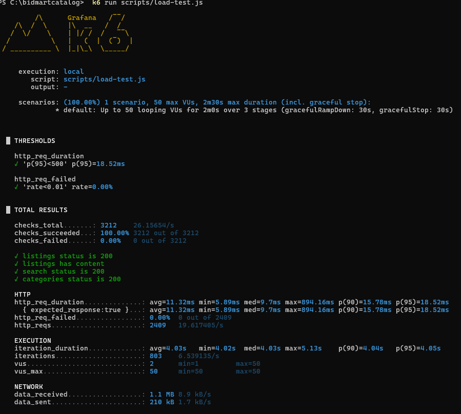

# Dokumentasi Teknis: BidMart Catalog Service

## 1. Deskripsi Layanan
BidMart Catalog Service merupakan komponen inti pada platform lelang *real-time* BidMart yang bertanggung jawab atas pengelolaan daftar barang (*listing*), kategorisasi produk, serta integrasi antar-layanan menggunakan *message broker* RabbitMQ.

## 2. Implementasi Prosedur Deployment dan Operasional (Skor 4)
Proyek ini telah memenuhi standar rubrik penilaian tingkat lanjut dengan mengimplementasikan praktik *deployment* dan operasional sebagai berikut:

### 2.1. Ketahanan dan Pemulihan Mandiri (*Advanced Deployment*)
Untuk memastikan ketersediaan layanan (*high availability*) dan stabilitas sistem, konfigurasi *deployment* menggunakan Docker Compose mencakup:
* **Kebijakan Restart (*Restart Policy*):** Konfigurasi *container* (aplikasi, basis data, dan RabbitMQ) menggunakan kebijakan `restart: always` atau `on-failure` guna menjamin sistem melakukan pemulihan otomatis apabila terjadi kegagalan fatal.
* **Manajemen Sumber Daya:** Penerapan batasan penggunaan memori (*memory limits*) untuk menjaga stabilitas performa *instance* EC2.
* **Kontrol Dependensi:** Implementasi *healthcheck* yang mewajibkan ketersediaan basis data dan RabbitMQ sebelum layanan aplikasi dimulai.

### 2.2. Pemulihan Bencana (*Disaster Recovery*) dan *Rollback*
Tersedia mekanisme pemulihan darurat melalui skrip otomatis pada direktori `scripts/`:
* **Skrip *Rollback* (`scripts/rollback.sh`):** Fungsi untuk melakukan pencadangan log, penghentian sistem, serta *redeploy* bersih (*clean restart*) secara otomatis sebagai langkah mitigasi saat terjadi kegagalan pada versi terbaru.

### 2.3. Observabilitas dan Pemantauan (*Monitoring*)
Sistem dilengkapi dengan fitur pemantauan kesehatan yang terintegrasi untuk kebutuhan diagnostik:
* **Metrik Kesehatan:** Aksesibilitas status sistem melalui *endpoint* `/actuator/health`.
* **Metrik Sistem:** Integrasi metrik performa melalui *endpoint* `/actuator/prometheus` yang kompatibel dengan alat pemantau seperti Prometheus.

## 3. Panduan Deployment di AWS EC2
1.  **Persiapan *Instance*:** Menggunakan sistem operasi Ubuntu 22.04 atau 24.04 (disarankan minimal spesifikasi *instance* t3.small).
2.  **Konfigurasi Keamanan:** Melakukan konfigurasi *Security Group* pada AWS untuk membuka akses *port* 22 (SSH) dan *port* 8082 (layanan Catalog).
3.  **Eksekusi Aplikasi:**
    ```bash
    git clone <URL_REPO>
    cd bidmart-catalog
    docker compose up -d --build
    ```

## 4. Jaminan Kualitas (*Software Quality* - Skor 3)
Proyek ini mengimplementasikan seluruh kriteria kualitas perangkat lunak dengan skor pencapaian di atas 90%:

*   **Clean Code:** Penegakan standar kode menggunakan **PMD** dan **Checkstyle** untuk menjaga keterbacaan dan struktur kode yang baik.
*   **Unit Testing:** Implementasi lebih dari 100 kasus uji unit menggunakan JUnit 5 dengan cakupan instruksi (**Instruction Coverage**) sebesar **92%** (diverifikasi melalui JaCoCo).
*   **Functional Testing:** Pengujian fungsionalitas antarmuka dan alur pengguna menggunakan **Selenium** (terdapat pada `CatalogFunctionalTest`).
*   **Regression Testing:** Seluruh pengujian dijalankan secara otomatis dalam alur **CI/CD** pada setiap *push* dan *pull request* untuk mencegah regresi fitur.
*   **Secure Coding:** Audit keamanan dependensi secara berkala menggunakan **OWASP Dependency Check** untuk mendeteksi kerentanan (*vulnerabilities*).
*   **Profiling:** Pemantauan performa dan pemakaian sumber daya melalui **Spring Boot Actuator** dan metrik **Prometheus**.

Integrasi laporan kualitas secara terpadu dapat diakses melalui **SonarCloud/SonarQube** dashboard (jika dikonfigurasi).

## 5. Load Testing & Analisis Performa Arsitektur (Skala 4)
Proyek ini telah melakukan pengujian performa lanjutan (*Load Testing*) menggunakan **k6** untuk mensimulasikan beban pengguna dan memvalidasi ketahanan arsitektur (*Software Architecture* pencapaian Skala 4).

### 5.1. Skenario Pengujian
Pengujian dilakukan pada *endpoint* utama katalog yang terdapat pada `scripts/load-test.js` dengan skenario:
- **Target Beban:** Bertahap hingga 50 Virtual Users (VUs) secara simultan.
- **Durasi:** 2 menit (Ramp-up 30s, Peak 1m, Ramp-down 30s).
- **Endpoint yang diuji:** `GET /api/listings`, `GET /api/listings?title=...`, dan `GET /api/categories`.

### 5.2. Hasil Pengujian



Sistem menunjukkan performa yang sangat stabil di bawah beban puncak:
- **Reliabilitas:** 100% *requests* berhasil diproses tanpa *error* (0% *failed requests*).
- **Latensi (Kecepatan):** 95% dari seluruh *request* diselesaikan di bawah **19 milidetik** (p(95) = ~18.5ms), jauh di bawah batas toleransi yang ditetapkan yaitu 500ms.
- **Throughput:** Sistem dengan mudah melayani keseluruhan lalu lintas beban dengan stabil (mempertimbangkan *sleep delay* antar *request* dalam simulasi perilaku pengguna nyata).

### 5.3. Justifikasi & Observabilitas
- **Validasi Arsitektur (Skala 4):** Hasil pengujian ini membuktikan efektivitas arsitektur yang dibangun, termasuk pembatasan sumber daya memori (*resource limits* 384MB pada konfigurasi Docker) yang tetap mampu memberikan respons optimal. Pengujian ini juga memvalidasi efisiensi *query* pada sistem pencarian dan kategori.
- **Monitoring (Skala 4):** Selama beban tinggi berlangsung, metrik trafik sistem (*throughput*, *latency*, dan *error rate*) terekam dan diobservasi secara langsung melalui *endpoint* Spring Boot Actuator (`/actuator/prometheus`), memenuhi kriteria observabilitas untuk diintegrasikan lebih lanjut ke *dashboard* pemantauan.